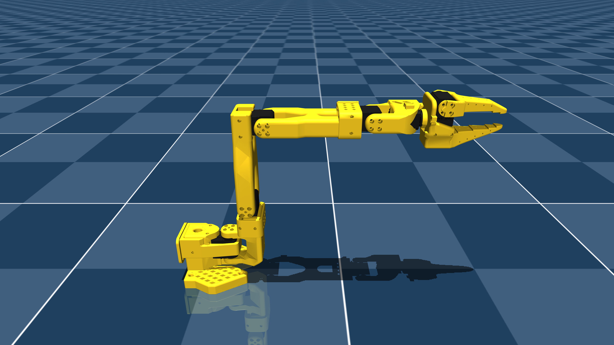

# The Robot Studio SO101 Description (MJCF)

> [!IMPORTANT]
> Requires MuJoCo 3.1.3 or later.

## Changelog

See [CHANGELOG.md](./CHANGELOG.md) for a full history of changes.

## Overview

This package contains a robot description (MJCF) of the [The Robot Studio SO101 robot](https://github.com/TheRobotStudio/SO-ARM100/tree/main/Simulation/SO101) developed by [I2
RT Robotics]. It is derived from the [publicly available
MJCF](https://github.com/TheRobotStudio/SO-ARM100/blob/608122e9ac330a753735f2e18aee73338e9ac407/Simulation/SO101/so101_new_calib.xml#L1).

  

## Simulation controls

Run `stm2sim.py` to launch MuJoCo validation with an offline policy.

The policy observation is built from box world coordinates, orientation, velocities, and contact:

- robot joint position `qpos` (6)
- robot joint velocity `qvel` (6)
- `box` world position (3)
- `gripperframe` world position (3)
- relative vector `box - gripperframe` (3)
- box velocity, end-effector velocity, relative velocity (9)
- box quaternion (4)
- contact signal (1)

- Default policy file: `offline_policy.npz`
- Required NPZ keys: `W0`, `b0`, ..., `Wn`, `bn`
- Optional NPZ keys: `act_scale`, `act_bias`, `tanh_out`

Example:

`python stm2sim.py --xml scene_box.xml --policy offline_policy.npz --log-interval 0.5 --smooth-adapt-gain 0.8 --contact-close-thresh 0.8`

### Convert PyTorch/ONNX policy to NPZ

Use `convert_policy_to_npz.py` to export an existing `.pt/.pth/.ckpt/.onnx` policy into `stm2sim.py` format.

Examples:

`python convert_policy_to_npz.py --input policy.onnx --output offline_policy.npz`

`python convert_policy_to_npz.py --input actor.pth --output offline_policy.npz --act-scale 1.0 --act-bias 0.0`

### Train a new NPZ policy directly

You can directly train a new policy and export it as `offline_policy.npz`.

This training uses Pinocchio IK as expert labels with 6D grasp pose (SE3 target), smooth box motion, trajectory filtering, and then trains a BC policy:

`python train_npz_policy.py --xml scene_box.xml --pin-mjcf so101.xml --output offline_policy.npz`

Recommended robust setting:

`python train_npz_policy.py --xml scene_box.xml --pin-mjcf so101.xml --output offline_policy.npz --episodes 120 --steps 500 --hidden 256,256,256 --epochs 1500 --lr 2e-3 --weight-decay 1e-5 --dropout 0.05 --ik-step 0.4 --ik-iters 100 --static-box-prob 0.2 --smooth-loss-adapt`

Optional tuning example:

`python train_npz_policy.py --xml scene_box.xml --pin-mjcf so101.xml --output offline_policy.npz --episodes 120 --steps 300 --hidden 256,256 --epochs 200 --lr 1e-3`

Loss visualization options:

`python train_npz_policy.py --xml scene_box.xml --pin-mjcf so101.xml --output offline_policy.npz --loss-plot training_loss.png --show-plot`

Notes:

- Exported NPZ now includes `obs_mean/obs_std` and `act_mean/act_std` for normalization.
- `stm2sim.py` automatically uses these stats for deployment.
- If strict trajectory filtering yields no samples, the trainer falls back to unscreened valid samples and prints a warning.
- Training and deployment now both use finite-difference velocity observations for distribution alignment.

## MJCF derivation steps

1. Copied `so101_new_calib.xml` (commit SHA aec17bbc256d1a7342d53aaa4950595d4c30b40d).
2. Rounded floats and reformatted the XML for readability.
3. Switched to implicitfast.
4. Use default `forcerange` for actuators rather than 3.35 N/m.
5. Added primitive collision geometries for the gripper and arm.
6. Add default collision solver parameters for the gripper that work well for manipulation.
7. Add a camera mount.

## License

This model is released under the [Apache License 2.0](LICENSE).
